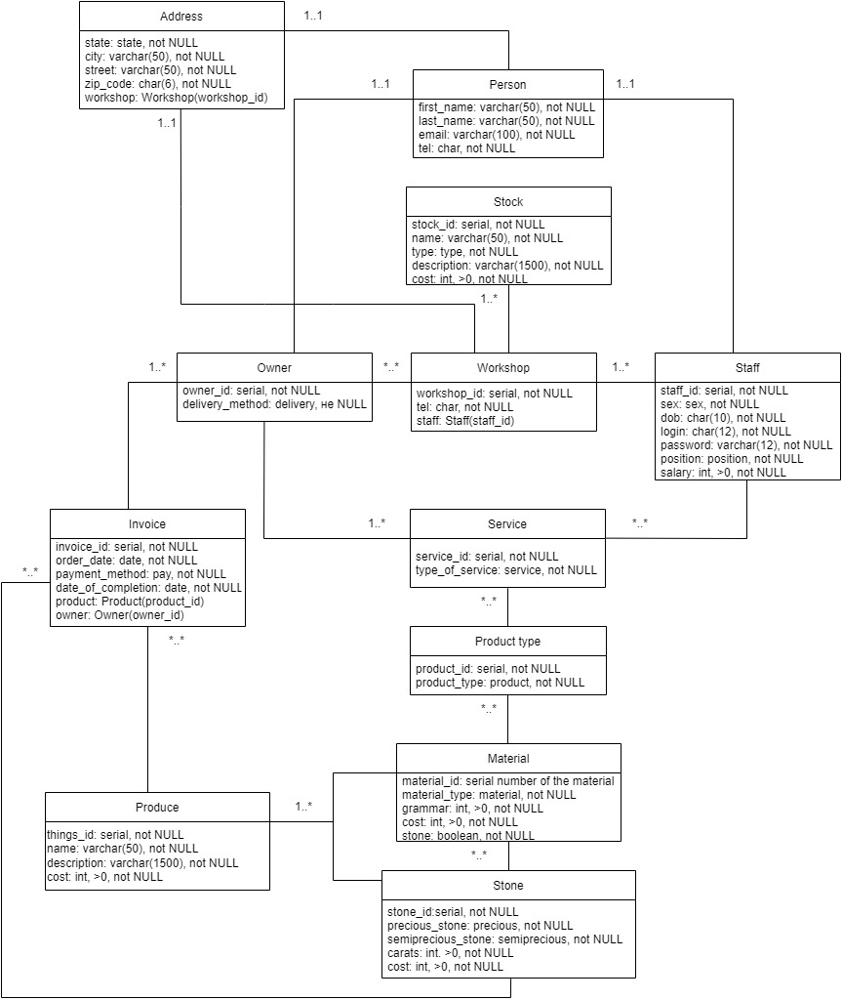

# "Карат", Потейчук Вероника Михайловна, 053501
База данных для частной ювелирной мастерской **"Карат"**  
## Требования к данным
#### Мастерские
Сеть ювелирных мастерских "Карат" имеет множество филиалов, расположенных в крупных городах Беларуси. Подробная информация о каждой мастерской вкоючает номер филиала мастерской, её адрес (улица, город, область и почтовый индекс),  а так же номера телефона. В каждой мастерской есть менеджер, администратор, мастера-ювелиры, специалисты по клинингу.
#### Сотрудники
Данные о каждом сотруднике включают номер сотрудника, ФИ (имя и фамилию), адрес (улицу, город, штат и почтовый индекс), номер телефона, дату рождения, пол, должность. и текущая годовая заработная плата. Штатный номер уникален.
#### Клиенты
Когда клиент впервые обращается в мастерскую, записываются его данные:  номер владельца, ФИ (имя и фамилия), адрес (улица, город, штат и почтовый индекс), email и номер телефона. Номер владельца уникален для всей базы мастерских.
#### Услуги
В каждой мастерской предоставляется следующий перечень услуг: ремонт ювелирного украшения, заказ на создание ювелирного украшения и покупка готового юверного украшения. База каждой мастерской содержит сведения о камнях, материалах (драгоценных металлах) и готовых украшениях, которые есть в наличии (или возможна поставка из других филиалов).
#### Вид изделия
Если клиент обратился по поводу ремонта своего украшения, в базу вносится вид изделия (кольцо, серьги, колье, браслет, подвеска, брошь, запонки, крестик), описание поломки (если надо паять и использовать свой материал, то вносится вид материала и расчёт идет уже с учётом этого фактора, если механическая починка - сразу выставляется стоимость за работу).
Если клиент хочет создать индивидуальное украшение, в базу вносится вид изделия (кольцо, серьги, колье, браслет, подвеска, брошь, запонки, крестик), пожелания клиента. 
Если клиент хочет приобрести готовое украшение, то в базу вносится индивидуальный номер этого украшения, описание и стоимость.
#### Материал
При ремонте украшения расчитывается стоимость материала, из которого сделано украшение, для его починки [украшения]. 
При создании индивидуального украшения, стоимость определяется исходя из количества материала для украшения.

**Стоимость за 1 грамм материала**:
* Золото
    - Проба 500 = 71,65Br
    - Проба 585 = 83,83Br
    - Проба 750 = 107,48Br
    - Проба 900 = 128,97Br
    - Проба 950 = 136,14Br
    - Проба 999 = 143,30Br
* Платина
    - Проба 950 = 76,88Br
    - Проба 999 = 80,93Br
* Палладий
    - Проба 999 = 179,97Br
* Серебро
   - Проба 750 = 1,36Br
   - Проба 875 = 1,58Br
   - Проба 925 = 1,67Br
   - Проба 960 = 1,74Br
   - Проба 999 = 1,81Br

####  Камень
При ремонте, если необходимо вставить наш камень в изделие, то к стоимости работы прибавляется стоимость за камень.
При создании индивидуального украшения, при желании клиента можно вставить камень. К стоимости работы прибавляется стоимость за камень/камни и его огранку.

**Стоимость камня за 1 карат**:
* Драгоценные
    - Александрит = от $5000
    - Бриллиант = от $5000
    - Изумруд = от $650
    - Рубин = от $5000
    - Сапфир = от $625
    - Хризоберилл = от $1333
* Полудрагоценные
    - Фианит = от $1
    - Аметист = от $10
    - Топаз = от $20
    - Цитрин = от $10
    - Раухтопаз = от $25
    - Хризолит = от $25
    - Гранат = от $20
    - Турмалин = от $40
    - Сфалерит = от $100
    - Пироп = от $70
    - Морганит = от $4
    - Индиголит = от $50
    - Диаспор = от $140
    - Аметрин = от $10
    
#### Счёт
Подробная информация, указанная в счёте-фактуре, включает номер счёта-фактуры, дату счёта-фактуры, номер заказчика, ФИ заказчика и полный адрес, а также сведения о оказанной услуге. В счёте указана стоимость за украшение. Также фиксируются дополнительные данные об оплате счета, включая дату оплаты счета, способ оплаты (например, наличные, кредитная карта) и была ли предоплата за индивидуальный заказ. Номер счета-фактуры уникален.

#### Продукция
В каждой мастерской есть некоторое количество ювелирных изделий, выставленных на продажу. Каждое из них единственное в своём представлении. Оно имеет свой уникальный личный номер, название, описание и стоимость. 

#### Инвентарь
Каждая мастерская имеет запас профессиональных принадлежностей (например, "буратина", весы, воск модельный и литьевой, станки, ручные инструменты и т.д.), химических реактивов (борная кислота, гидроокись натрия, сера техническая, карбонат калия и т.п.) и бытовых принадлежностей (например, полиэтиленовые пакеты, фартуки, бытовая химия, пылесос и т.п.). Подробная информация о профессиональных, химических и бытовых расходных материалах включает номер и название позиции, описание позиции, количество на складе (это устанавливается в последний день каждого месяца), уровень повторного заказа, количество повторного заказа и стоимость. Номер позиции однозначно идентифицирует каждый тип расходного материала. Номер элемента уникален для каждого предмета и используется на протяжении всей практики. 

## Список объектов
- Мастерская
- Клиент
- Сотрудники
- Услуги
- Вид изделия
- Материал
- Камень
- Счёт
- Продукция
- Инвентарь
---
## Требования
1. **Обязательные функциональные требования**
* Авторизация пользователя
* Управление пользователями (CRUD)
* Ролевая система (администратор, менеджер, мастер-ювелир)
* Логирование
2. **Возможности работы с сайтом**: 
3. **Администратор**
- Создавать профили новых сотрудников (ФИ, адрес, пол, дату рождения, телефон, логин, пароль, позицию и заработную плату)
- Следить за наличием расходного материала на складе и заниматься закупкой.
- Следить за финансами мастерской (доходы и расходы) и делать отчёт в конце каждого месяца.
 
**Менеджер**
- Вносить в клиентскую базу данные заказчика (ФИ, адрес, телефон)
- Принимать заказы клиентов, делать описание желаемого изделия, вносить данные о предоплате
- Создавать счёт на основе отчёта мастера-ювелира о задействованных материалах.
- Продавать готовое изделие, имеющееся в наличии в мастерской.
- Создаёт счёт и расчитывать клиентов, помечая способ оплаты.

**Мастер-ювелир**
- Создавать отчёт о количестве затраченного материала на изготовление изделия.

## Схема базы данных

## Атрибуты, связанные с сущностями
| Организация | Атрибуты | 
|:------:|:--------|
| Мастерская     | id, адрес (улица, город, область, почтовый индекс), телефон     |
| Клиент     | id, ФИО, адрес (улица, город, область, почтовый индекс), телефон, email, способ доставки      |
| Сотрудники     | id, ФИО, адрес (улица, город, область, почтовый индекс), телефон, дата рождения, пол, должность, зарплата    |
| Услуги     | id, вид услуги (заказ, ремонт, покупка готового изделия)   |
| Вид изделия     | id, вид изделия (кольцо, серьги,	колье, браслет, подвеска, брошь, запонки, крестик, описание)   |
| Материал     | id, вид материала (золото, серебро, платина, палладий), цена   |
| Камень     | id, вид (драгоценный, полудрагоценный) фианит, изумруд, бриллиант, аметист, янтрарь, топаз, рубин, сапфир, цитрин, раухтопаз, хризолит, гранат, танзанит, топаз, турмалин, сфалерит, пироп, морганит, индиголит, диаспор, аметрин, аметист, хризоберилл, александрит, цвет|
| Счёт     | id, дата заказа, способ оплаты, (предоплата за изготовление украшения, примерная дата изготовки изделия)   |
| Продукция     | id, название, описание, стоимость   |
| Инвентарь     | id, тип, название, описание, стоимость   |
***
## Сущности
**Мастерская**
| Название | Описание | Дополнительная информация |
|-------|----------|---------|
| workshop_id     | серийный, не NULL     | первичный ключ     |
| street     | VARCHAR(50), не NULL      |       |
| city     | VARCHAR(50), не NULL   |       |
| state     | state, не NULL   |  Enumerated Type     |
| zip_code     | CHAR(10), не NULL   | ХХХХХ-ГГГГ, альтернативный ключ      |
| tel     | CHAR(10), не NULL   | +375 (двузначный код оператора) XXX-XXXX, альтернативный ключ      |
| staff     |    | Ссылки на внешний ключ Staff(staff_id)      |

*Enum **state** ("Брестская, Витебская, Гомельская, Гродненская, Минская, Могилёвская")*
*****

**Заказчик**
| Название | Описание | Дополнительная информация |
|-------|----------|---------|
| owner_id     | серийный, не NULL     | первичный ключ     |
| first_name     | VARCHAR(50), не NULL      |       |
| last_name     | VARCHAR(50), не NULL      |       |
| street     | VARCHAR(50), не NULL      |       |
| city     | VARCHAR(50), не NULL   |       |
| state     | state, не NULL   |      Enumerated Type |
| zip_code     | CHAR(10), не NULL   | ХХХХХ-ГГГГ      |
| tel     | CHAR(10), не NULL   | +375 (двузначный код оператора) XXX-XXXX, альтернативный ключ      |
| email     | CHAR(50), не NULL   | XXX@XX.XX      |
| workshop     |    | Ссылки на внешний ключ Workshop(workshop_id)      |
| delivery_method | delivery, не NULL | Enumerated Type |

*Enum **state** ("Брестская, Витебская, Гомельская, Гродненская, Минская, Могилёвская")
Enum **delivery** ("Самовывоз", "Доставка курьером")*
*****

**Cотрудники**
| Название | Описание | Дополнительная информация |
|-------|----------|---------|
| staff_id     | серийный, не NULL     | первичный ключ     |
| first_name     | VARCHAR(50), не NULL      |       |
| last_name     | VARCHAR(50), не NULL      |       |
| street     | VARCHAR(50), не NULL      |       |
| city     | VARCHAR(50), не NULL   |       |
| state     | state, не NULL   |      Enumerated Type |
| sex     | sex, не NULL   |      Enumerated Type |
| zip_code     | CHAR(6), не NULL   | ХХХХХX      |
| DOB     | CHAR(10), не NULL   | DD.MM.YYYY      |
| tel     | CHAR(9), не NULL   | +375 (двузначный код оператора) XXX-XXXX, альтернативный ключ      |
| login     | CHAR(12), не NULL   |       |
| position | position, не NULL | Enumerated Type  |
| salary | INT,>0, не NULL |  |
| workshop     |    | Ссылки на внешний ключ Workshop(workshop_id)      |

*Enum **sex** ("Женский", "Мужской", "Средний")
Enum **state** ("Брестская, Витебская, Гомельская, Гродненская, Минская, Могилёвская")
Enum **position** ("Мастер-ювелир", "Администратор", "Менеджер", "Специалист по клинингу")*
*****

**Услуги**
| Название | Описание | Дополнительная информация |
|-------|----------|---------|
| service_id     | серийный, не NULL     | первичный ключ     |
| type_of_service     | service, не NULL      |  Enumerated Type      |

*Enum **service** ("Заказ", "Ремонт", "Покупка")*
*****

**Вид изделия**
| Название | Описание | Дополнительная информация |
|-------|----------|---------|
| product_id     | серийный, не NULL     | первичный ключ     |
|   product_type   | product, не NULL      |  Enumerated Type     |

*Enum **product** ("Кольцо", "Серьги", "Колье", "Браслет", "Подвеска", "Брошь", "Запонки", "Крестик")*
*****

**Драгоценный металл (материал изделия)**
| Название | Описание | Дополнительная информация |
|-------|----------|---------|
| material_id     | серийный, не NULL      |  первичный ключ     |
| material_type     | material, не NULL      |    Enumerated Type   |
| grammar     | INT, >0, не NULL      |    Enumerated Type   |
| cost     | INT, >0, не NULL   |    "от " cost.material*grammar  "рублей" |

*Enum **material** ("Золото", "Серебро", "Платина", "Палладий")*
*****

**Камень**
| Название | Описание | Дополнительная информация |
|-------|----------|---------|
| stone_id     | серийный, не NULL      |  первичный ключ     |
| precious_stone     | precious, не NULL      |   Enumerated Type |
| semiprecious_stone     | semiprecious, не NULL      |    Enumerated Type  cubic_zirconia, amethyst, topaz, citrine, rauchtopaz, chrysolite, garnet, tanzanite, tourmaline, sphalerite, pyrope, morganite, indicolite, diaspore, ametrine  |
| carats     | INT, >0, не NULL   |     |
| cost     | INT, >0, не NULL   |    "от " Material.cost + cost  "рублей" |

*Enum **precious** ("Александрит", "Бриллиант", "Изумруд", "Рубин", "Сапфир", Хризоберилл)
Enum **semiprecious** ("Фианит", "Аметист", "Топаз", "Цитрин", "Раухтопаз", "Хризолит", "Гранат", "Танзанит", "Турмалин", "Сфалерит", "Пироп", "Морганит", "Индиголит", "Диаспор", "Аметрин")*
*****

**Счёт**
| Название | Описание | Дополнительная информация |
|-------|----------|---------|
| invoice_id     | серийный, не NULL     | первичный ключ     |
|   order_date   | DATE, не NULL      |     DD.MM.YYYY hh:mm:ss  |
|   payment_method   | pay, NOT NULL	      |   Enumerated Type    |
|   prepayment   | INT, NOT NULL	      |   !< 0.3Stone.cost    |
|   date_of_completion   | DATE, не NULL      |     DD.MM.YYYY hh:mm:ss  |
|   product   |       |     Ссылки на внешний ключ Product(product_id), описание
|   owner   |       |     Ссылки на внешний ключ Owner(owner_id)|

*Enum **pay** ("Наличный расчёт", "По карте")*
*****

**Продукция**
| Название | Описание | Дополнительная информация |
|-------|----------|---------|
| things_id     | серийный, не NULL     | первичный ключ     |
|   name   | VARCHAR(50), не NULL      |       |
|   description   | VARCHAR(1500), NOT NULL	      |       |
|   cost   | INT, >0, NOT NULL	      |       |
*****

**Инвентарь**
| Название | Описание | Дополнительная информация |
|-------|----------|---------|
| stock_id     | серийный, не NULL     | первичный ключ     |
|   name   | VARCHAR(50), не NULL      |       |
|   type   | type, не NULL      |   Enumerated Type  |
|   description   | VARCHAR(1500), NOT NULL	      |       |
|   cost   | INT, >0, NOT NULL	      |       |

*Enum **type** ( "профессиональное оборудование", "химические реактивы", "бытовые принадлежности", "Металлы и камни")*
_____________________________________________
_________________________________________________

## Даталогическая модель

